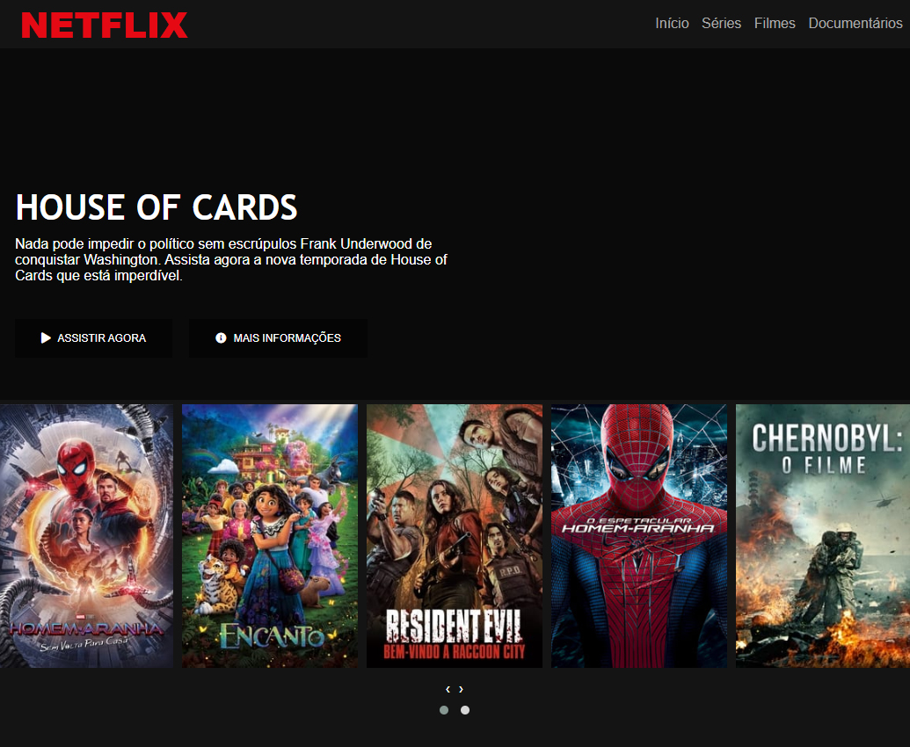

# Clone do Netflix
## Recriando a Interface do Netflix
---
Material desenvolvido como hands-on durante as videoaulas em Bootcamp da Digital Innovation One, ministradas pelo professor Felipe Aguiar.

---

---

## Tecnologias envolvidas:
- HTML 5
- CSS 3
- Javascript
- JQuery
- Font Awesome
- owlCarousel2

## Conceitos envolvidos:
Flexbox, responsividade, posicionamento de elementos na tela e demais recursos HTML5 e CSS 3.
